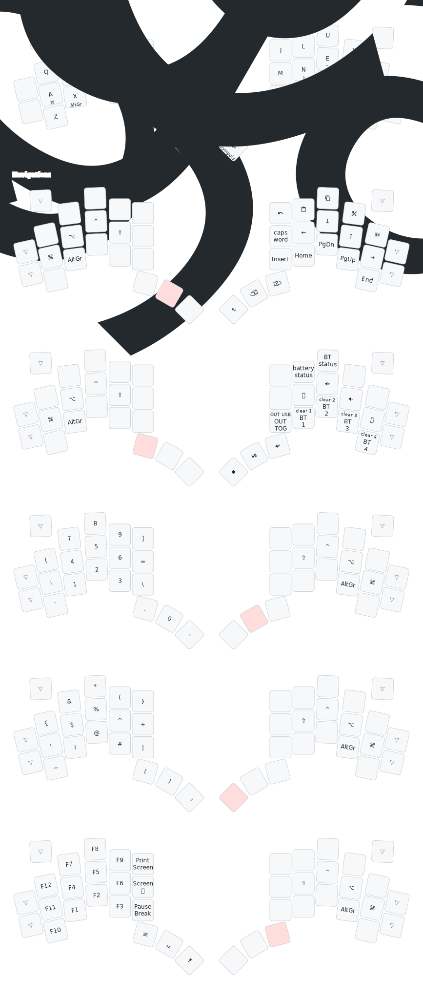

# Lintilla ZMK

Configuring and building [ZMK](https://zmk.dev/) Firmware for the [Lintilla](https://github.com/ctranstrum/lintilla/) keyboard.

## Features

The pipeline builds for left central and right peripheral.
It further builds a settings reset that can be flashed to both halves to remove any residual bluetooth settings that could mess up connections.
Finally, I've added an [info.json](/config/lintilla.json) to support editing the config in [Keymap Editor](https://github.com/nickcoutsos/keymap-editor).

## Layouts

I've tagged working versions of layouts for easy access.

### Miryoku

[Here](https://github.com/OptionalM/zmk-config/releases/tag/Miryoku_v1.0) I've recreated the popular [miryoku layout](https://github.com/manna-harbour/miryoku?tab=readme-ov-file).
Miryoku comes in many flavors, but I opted for one close to what could be considered "default":

- Alpha layout is Colemak-DH
- Homerow Mod order is Super, Alt, Ctrl, Shift; The bottom row ring finger is AltGr
- Symbol, Number and Function Layer are accessed through the right thumb cluster
- Media and Navigation Layer are accessed through the left thumb cluster
- Mouse Layer is omitted as I don't use it x.x
- Navigation Layer comes in its home-row variant that does not move the arrows to the vim spot
- Paste, Copy, and Cut are using the somewhat universal commands <kbd><kbd>LShift</kbd> + <kbd>Ins</kbd></kbd>, <kbd><kbd>LCtrl</kbd> + <kbd>Ins</kbd></kbd>, and <kbd><kbd>LShift</kbd> + <kbd>Del</kbd></kbd>
- Redo is replaced with Undo (<kbd><kbd>LCtrl</kbd> + <kbd>Z</kbd></kbd>), which can be transformed into redo by also holding <kbd>LShift</kbd>
- Undo is replaced with Select All (<kbd><kbd>LCtrl</kbd> + <kbd>A</kbd></kbd>)

